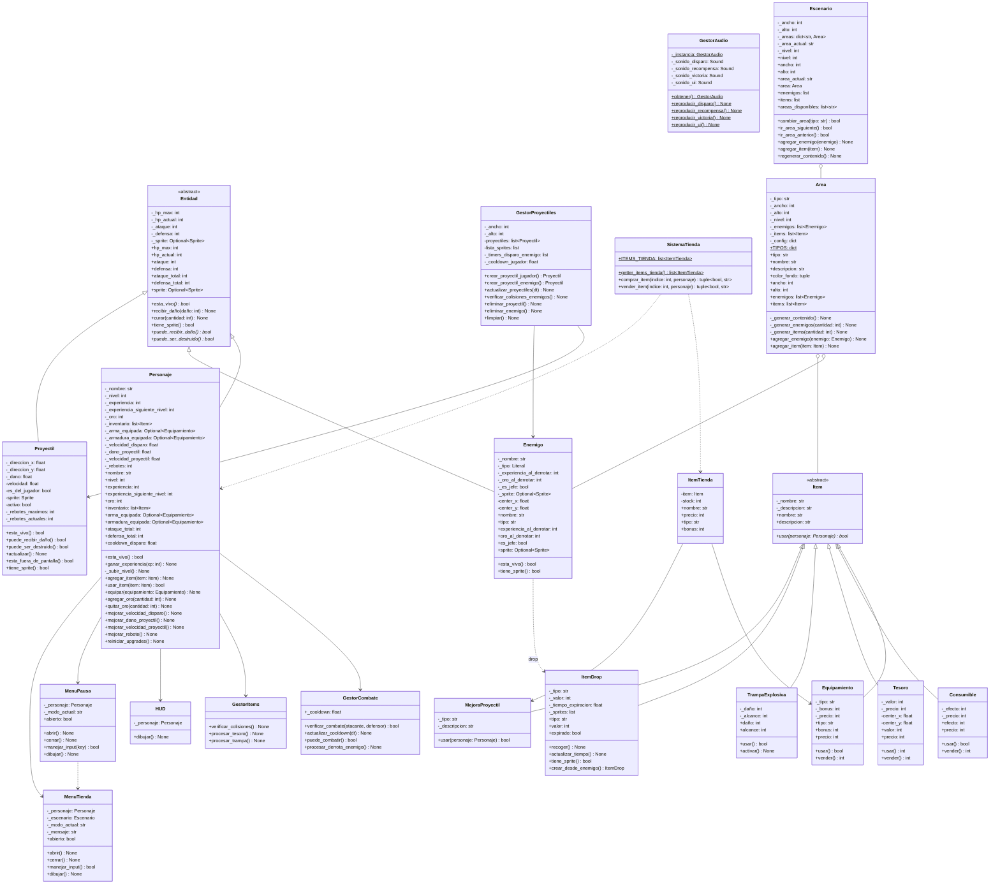

# Diagramas del Proyecto

## Diagrama de Clases

## Descripción de las Relaciones

### Herencia (Generalización)

- **Entidad** → Clase abstracta base de la cual heredan `Personaje`, `Enemigo` y `Proyectil`. Define los atributos comunes: HP, ataque, defensa, sprite.
- **Item** → Clase abstracta base de la cual heredan `Equipamiento`, `Consumible`, `Tesoro`, `TrampaExplosiva`, `ItemDrop` y `MejoraProyectil`.

### Asociación

- **Personaje** ↔ **GestorCombate**: El personaje puede atacar y recibir ataques a través del gestor de combate.
- **Personaje** ↔ **GestorItems**: Gestiona la colección de items del suelo.
- **GestorProyectiles** ↔ **Proyectil**: Crea y gestiona proyectiles.
- **GestorProyectiles** ↔ **Enemigo**: Verifica colisiones projectile-enemigo.
- **ItemDrop** ↔ **Enemigo**: Los enemigos sueltan items al morir.
- **Escenario** ↔ **Area**: Un escenario contiene múltiples áreas.
- **Personaje** ↔ **MenuPausa**: El menú de pausa actúa sobre el personaje.
- **Personaje** ↔ **MenuTienda**: El menú de tienda actúa sobre el personaje.
- **GestorAudio** ↔ *(singleton)*: Proporciona métodos estáticos para reproducir sonidos del juego.
- **SistemaTienda** ↔ **Personaje**: Gestiona transacciones de compra/venta de items.
- **SistemaTienda** ↔ **ItemTienda**: Contiene items disponibles para la venta.

### Agregación

- **Personaje** → **Inventario** (list[Item]): El personaje tiene un inventario.
- **GestorProyectiles** → **Proyectiles** (list[Proyectil]): Gestor administra múltiples proyectiles.
- **Area** → **Enemigos** (list[Enemigo]): El área contiene enemigos.
- **Area** → **Items** (list[Item]): El área contiene items.
- **Escenario** → **Area** (contains): El escenario contiene múltiples áreas.

### Composición

- **Escenario** → **Area**: El escenario gestiona las áreas. Si el escenario se destruye, las áreas también.
- **GestorProyectiles** → **_timers_disparo_enemigo, _cooldown_jugador**: Timers internos del gestor.

## Notas de Diseño

1. **Patrón Service Layer**: `GestorProyectiles`, `GestorCombate`, `GestorItems` y `SistemaTienda` actúan como servicios que gestionan lógicas de juego específicas.
2. **Patrón Singleton**: `GestorAudio` implementa el patrón singleton para mantener una única instancia global de audio.
3. **Patrón Observer implícito**: El `HUD` observa al `Personaje` para actualizar la UI cuando cambian los stats.
4. **Patrón Factory implícito**: `GestorProyectiles.crear_proyectil_jugador()` y `GestorProyectiles.crear_proyectil_enemigo()` actúan como factories.
5. **Patrón Entity-Component**: Proyectil tiene su propio sprite, lo que permite rendering independiente.
6. **Encapsulamiento**: Uso de properties para proteger los atributos privados.
7. **Herencia vs Composición**: Se usa herencia para entidades del dominio (Personaje, Enemigo, Items, Proyectil) y composición para sistemas (Gestores).
8. **Sistema de Upgrades**: Personaje tiene métodos para mejorar estadísticas de proyectiles (velocidad, daño, rebotes).
9. **Sistema de Tienda**: `SistemaTienda` centraliza la lógica de compra/venta de items, interactuando con el inventario y oro del personaje.

## Atributos Nuevos en Personaje (Sistema de Proyectiles)

- **_velocidad_disparo**: Controla la velocidad de fuego del personaje.
- **_dano_proyectil**: Daño base de los proyectiles del personaje.
- **_velocidad_proyectil**: Velocidad de movimiento del proyectil.
- **_rebotes**: Cantidad de rebotes que puede tener un proyectil.

Estos atributos pueden mejorarse mediante los métodos `mejorar_*()` y se resetean con `reiniciar_upgrades()`.
